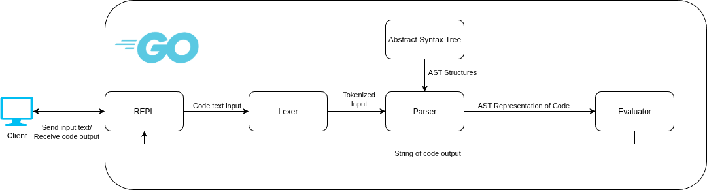

# LearningLanguage
A programming language designed to serve as a tool to bridge the gap between a students understanding of block-based languages like Scratch and complex modern lanugages like Java or C++.

### Problem Statement
There is a large gap in programming language complexity between those you would use in elementary/middle school education and high school AP courses/lower-division collegiate courses. This gap in complexity stems from two factors: the jump from block-based to text-based programming, and the wide range of features in modern languages such as Java, Python, and JavaScript. 

### System Architecture


### Requirements
[Go Installation Instructions](https://go.dev/doc/install)
Clone the repo to its own directory

### Running the REPL
To run an interactive REPL on the command line, in the directory with main.go run

```bash
go run ./main.go
```

If you want to use file input, use
```bash
go run ./main.go -i <filename>.txt
```

If you want to use file output, use
```bash
go run ./main.go -o <filename>.txt
```
Both of these parameters can be used together.

### Language Documentation
#### Variable Creation/Assignment
To create a variable, use the following syntax:

```
create int/bool/string/float <identity>;
```

In order to assign a value to a variable, it first needs to be created, then use:
```
set <identity> = <expression>;
```

#### Valid Expressions
The following are the valid types of expressions within the language:
* Literals (123, true/false, 3.14, "Text", [1, 2, 3, 4])
* Prefix Expressions (-4, !false)
* Arithmetic Infix Expressions (1+1, 4-2, 10/5, 4*4)
* Comparison Infix Expressions (>, >=, ==, !=, <, <=)
* Length Expression (len(list)) (ONLY for lists)


#### If Statements
LearningLanguage operates on if/else pairs only, no else if. If you wish to achieve if else logic, nested if statements are needed.
Any statement that requires curly braces or newlines in other languages will use ```begin;``` to indicate the start of the body and ```end;``` to indicate the ending of the body.
```
if (1 > 2) begin;
print("1 is less than 2");
end;
else begin;
print("1 is not less than 2");
end;
```

#### While Loops
A while loop in LearningLanguage executes a sequence of statements so long as the condition remains true.
```
create int a;
set a = 0;
while (a < 10) begin;
set a = a + 1;
print(a);
end;
```

#### Count Loops
Similar to for loops in other languages, a count loop starts from one number and ends at another while incrementing by a specified value
The 'by' value defaults to 1.
To print from 1 to 10:
```
count i from 1 to 10 by 1 begin;
print(i);
end;

OR

count i from 1 to 10 begin;
print(i);
end;
```

#### Structures
To create a structure, use the following syntax:
```
struct myStruct(
    int x,
    bool y,
    string z
) [
    x: 123,
    y: true,
    z: "test"
];
```
Assignment of attributes of the structure are optional, allowing for the following:
```
struct myStruct(
    int x,
    bool y,
    string z
);
set myStruct.x = 123;
set myStruct.y = true;
set myStruct.z = "test";
```
To access attributes of a structure:
```
myStruct.x;
```
#### Lists
To create a list, use the following syntax:
```
create int list myList;
set myList = [1, 2, 3];
```

Lists in LearningLanguage use 1-based indexing
To access an element of the list, use the following syntax:
```
myList[1]
```

To get the length of a list, use the following syntax:
```
len(myList)
```

To append to a list, use the following syntax:
```
append 4 to myList;
```

#### Printing
In order to have your code output anything, you need a print statement:
```
print(1+2);
print("Hello World");
```
To print a newline, use:
```
println("");
println(1+2);
```
The parameters for printing are any expression.